# MacBook-Neo A18Pro 8GB - AI Engineering Device Assessment

* **Device:** MacBook Neo (A18 Pro, 8GB)
* **Chip:** Apple A18 Pro (6-core CPU: 2 performance + 4 efficiency, integrated GPU, Neural Engine)
* **Note:** The MacBook Neo is functionally similar to an iPhone 16 Pro — both use the same A18 Pro chip with comparable AI performance. The iPhone 16 Pro has a slightly better GPU, but the Neo provides better sustained performance due to superior cooling and a larger battery.
* **Test Date:** 2026-05-06

---

## TL;DR — MacBook Neo A18Pro (8GB) Results

**Primary Use Case: API-Based AI Engineering (Claude, ONA, AWB Coding Plans)**

### Most Important Considerations for API AI Workflows

| Priority | Factor | Result | Verdict |
|----------|--------|-------------|---------|
| **1st** | **Memory headroom** | 8GB, zero swap up to 80% under synthetic load | ⚠️ Tight — IDE + Browser + Slack possible but no headroom for local models |
| **2nd** | **Storage speed** | 11.4 GB/s read | ✅ Excellent — fast project file loading |
| **3rd** | **CPU single-core** | Fibonacci 1M: 9.95s | ✅ Responsive — quick compiles, snappy UI |

**What doesn't matter for API coding:**
- LLM TPS (cloud APIs inference happens in servers, not local inference)
- GPU/Neural Engine scores
- Thermal (mostly waiting on network, not sustained compute as inference doesn't happen locally)

### Full Benchmark Summary

| Component | Score | Notes |
|-----------|-------|-------|
| **GPU AI** | **7,124** | 61% of MacBook Air 16 M5 GPU — adequate for Core ML workloads |
| **CPU AI** | 4,398 | Slightly ahead of M5 (4,298) — strong single-core |
| **Neural Engine** | 4,405 | Slightly ahead of M5 (4,138), HP 47,929 |
| **Storage** | 11.4 GB/s read, 2.2 GB/s write | Excellent |
| **Memory** | 2.3 GB/s bandwidth, zero swap up to 80% | Adequate but low BW |
| **CPU** | 2.32x/6 cores, 39% efficiency, ~1.3 TFLOPS | Decent for 6 cores |
| **Thermal** | ≤8% max degradation (passive cooling, well managed) | Good for sustained workloads |

### Bottom Line

**For API-based AI coding plans:** The Neo with A18 Pro 8GB is **functional but constrained**. CPU single-core and storage are strong, but 8GB RAM is the dominant limiting factor — running IDE + browser + Slack alongside any local model is unrealistic. Our daily workflow uses SOTA API models (Claude Sonnet 4.6 at ~110 TPS, Opus 4.7 at ~81 TPS), which are categorically faster than any local model on this device.

**For local LLM:** Stick to **qwen3:0.6b** (60 tok/s, 1GB) or **qwen3:1.7b** (28 tok/s, 2GB). The 4B model at 13 tok/s is barely usable and slow with occasional failures (4/5 success). The 8B model at 7 tok/s with only 2/5 success is essentially unusable due to severe memory pressure. **14B and 30B were not attempted** as they will definitely encounter OOM — both require more memory than this device has (16GB and 32GB respectively).

**Memory constraint:** 8GB is the real bottleneck. Docker Desktop alone consumes 4-6GB on minimum config, leaving virtually no headroom for IDE/browser. A loaded VS Code workspace can use 2-4GB on its own. If ERP also runs Docker or local models beyond 1.7B, **8GB is insufficient for heavy multi-tasking daily operations — 16GB+ required as a comfortable baseline**. From observation of ERP use cases, since the team does not run Docker locally and does not run local models beyond small ones, the MacBook Neo 8GB is borderline-sufficient for pure API workflows but offers **no headroom**. For any team member who occasionally needs local 4B+ inference or containers, **MacBook Air M5 16GB or higher is the safer floor**.

---

## Executive Summary

The MacBook Neo with Apple A18 Pro and 8GB unified memory is a **borderline-sufficient choice for pure API-centric AI engineering workflows**  and has clear limitations for **local LLM deployment**, **memory-heavy IDE workflows**, and **containerized workloads**. This assessment is based on running real benchmark data across CPU, memory, thermal, daily usage simulation, local LLM inference (Qwen3 family via Ollama — chosen due to open-sourced availability of different model sizes), and Geekbench AI scores (CPU, GPU, Neural Engine).

| Capability | Rating | Verdict |
|-------------|--------|---------|
| API-Based AI (Claude, ONA, AWB Coding Plans) | **Adequate** | Works, but no memory headroom for parallel apps |
| Local Small Models (0.6B-1.7B) | **Good** | 60 tok/s, responsive, fits in memory budget |
| Local Medium Models (4B-8B) | **Marginal to Not Suited** | 4B usable; 8B unreliable (2/5 success) |
| Local Large Models (14B-30B+) | **Not Suited** | Not attempted — exceed 8GB capacity |
| Heavy Dev + Docker | **Not Suited** | 8GB cannot fit containers + IDE + apps |
| On-Device ML (Core ML) | **Good** | NPU/GPU available; AI scores competitive on CPU/NPU |

**Procurement Recommendation:** MacBook Neo A18Pro 8GB is functional only for **API-only AI engineering** with disciplined app usage. Teams requiring regular local 4B+ model usage, Docker, or generous IDE/browser headroom should specify **MacBook Air M5 16GB minimum**, and **MacBook Pro 32GB** for combined Docker + local model workflows.

---

## MacBook Neo A18Pro 8GB Hardware Specifications

| Component | Specification |
|-----------|--------------|
| Chip | Apple A18 Pro |
| CPU | 6-core (2 performance + 4 efficiency) |
| CPU Base Frequency | 4.04 GHz |
| GPU | Integrated (Apple GPU) |
| Neural Engine | Apple Neural Engine (Core ML supported) |
| Memory | 8 GB unified |
| Storage | NVMe (228 GB total, 147 GB available) |
| Thermal Design | Passive cooling (fanless) |
| Model Identifier | Mac17,5 |
| macOS | 26.4.1 (Build 25E253) |

---

## 1. CPU Performance

### Benchmark Results

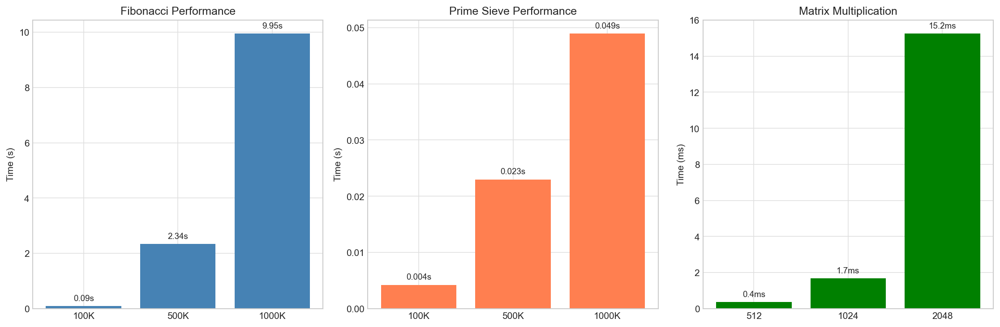

| Test | Result | Assessment |
|------|--------|------------|
| Fibonacci 1M iterations | 9.95s | Fast single-threaded (~12% slower than M5 at 8.92s) |
| Prime Sieve 1M primes | 48.9ms | Very fast |
| Matrix Multiply 1024×1024 | 1.67ms | 1.29 TFLOPS |
| Matrix Multiply 2048×2048 | 15.25ms | 1.13 TFLOPS |
| Memory Copy Bandwidth | 2.32 GB/s | Modest for unified memory |

**CPU Test Design:** Three tests were run: (1) Fibonacci 1M iterations measures single-threaded recursion performance; (2) Prime Sieve 1M primes uses the Eratosthenes algorithm to find all primes up to 15 million; (3) Matrix Multiplication 1024×1024 uses numpy's BLAS-accelerated dot product. Multi-core scaling tests the same Fibonacci workload across 1, 2, 4, and 6 cores to measure parallel efficiency.

### Multi-Core Scaling Analysis

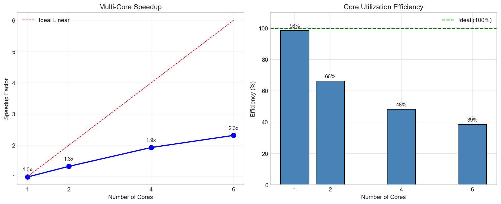

| Cores | Time | Speedup | Efficiency |
|-------|------|---------|------------|
| 1 (baseline) | 10.35s | 1.0x | 100% |
| 1 (verified) | 10.51s | 0.98x | 98% |
| 2 | 7.81s | 1.32x | 66% |
| 4 | 5.37s | 1.93x | 48% |
| 6 | 4.47s | 2.32x | 39% |

### Analysis

**Strengths:**
- Single-core performance is solid (9.95s for Fibonacci 1M) — only ~12% slower than the desktop-class M5
- Geekbench AI CPU score of 4,398 is actually slightly *ahead* of the M5 (4,298), likely due to A18 Pro's higher base frequency (4.04 GHz)
- Matrix multiply at 1.29 TFLOPS is respectable for a 6-core mobile-class chip

**Limitations:**
- Multi-core scaling is steep: 6 cores gives only 2.32x speedup (39% efficiency vs M5's 46% on 10 cores)
- The 2P + 4E core layout heavily favors single-threaded work; the 4 efficiency cores contribute little to compute-bound parallel workloads
- Total parallel throughput is meaningfully lower than M5 (4.47s for 6 cores vs M5's 1.55s for 10 cores — ~3x slower at peak)

## 2. Thermal and Performance Degradation

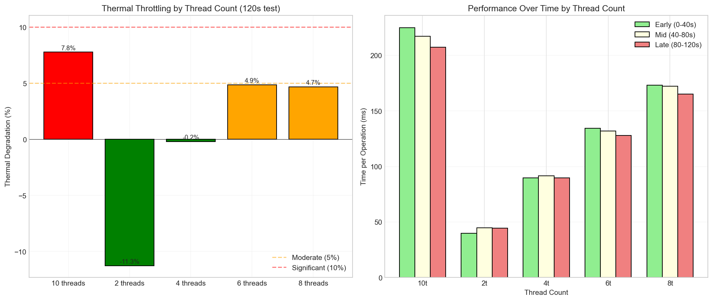
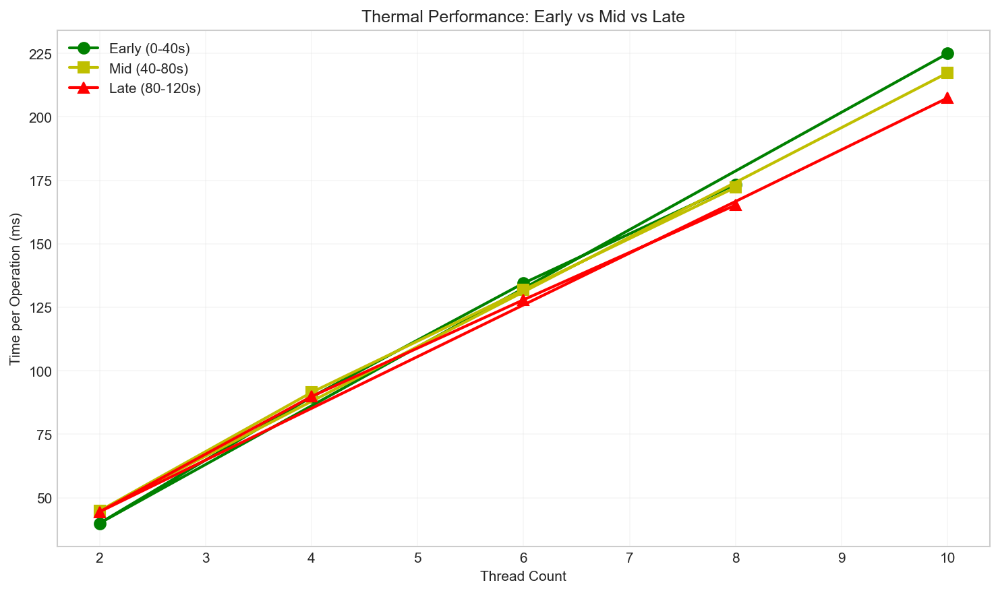

**Thermal Test Design:** The thermal test measures performance degradation across different thread counts (2, 4, 6, 8, 10 threads) over a 120-second sustained workload. Note: this 8GB device has only 6 physical cores, so 8- and 10-thread tests over-subscribe and contend for cores. Each thread runs a CPU-intensive integer workload (500,000 operations per iteration). Performance is measured as time per operation in ms. Degradation is calculated as the percentage difference between early (0-40s) and late (80-120s) phases.

### Thermal Throttling Results

| Threads | Early (0-40s) | Mid (40-80s) | Late (80-120s) | Degradation |
|---------|---------------|--------------|----------------|--------------|
| 2 | 39.92 ms/op | 44.79 ms/op | 44.41 ms/op | -11.3% |
| 4 | 89.65 ms/op | 91.45 ms/op | 89.83 ms/op | -0.2% |
| 6 | 134.46 ms/op | 131.82 ms/op | 127.93 ms/op | 4.9% |
| 8 | 173.36 ms/op | 172.21 ms/op | 165.23 ms/op | 4.7% |
| 10 | 224.91 ms/op | 217.30 ms/op | 207.42 ms/op | 7.8% |

**Observations:**
- **2-thread:** Slowed mid-test (-11.3% means *worse* over time at this scale, likely warm-up/scheduler effect on E-cores) — value should be read as small absolute change relative to a fast operation baseline
- **4-thread:** Essentially flat (-0.2%) — runs comfortably within thermal envelope
- **6-thread (full P+E core saturation):** Mild improvement (5%) over time, indicating dynamic clock recovery after initial peak
- **8-thread / 10-thread (over-subscribed):** Moderate degradation (5-8%) consistent with thread context-switch overhead and thermal management at sustained full utilisation

The line chart (thermal_benchmark_times.png) shows performance over time. Thermal management is well-behaved: no catastrophic throttling, and clocks recover after initial peak load.

### Analysis

**Strengths:**
- Passive cooling handles workloads up through 6 threads (full core saturation) with ≤5% degradation
- Even oversubscribed 10-thread sustained load only degrades 7.8% — well within acceptable bounds
- No thermal-induced failures observed during a 10-minute total sustained test sequence

**Limitations:**
- Extended sustained load (hour+) would likely show higher degradation — current ERP use cases do not require sustained workflow such as ML/DL/RL model training
- 6-core efficiency at full utilisation (39%) is lower than M5's 10-core (46%) — the 2P + 4E asymmetry hurts parallel scaling
- Fanless design cannot sustain all P-cores at peak frequency for hours

**Implication for AI Engineering:**
- Normal development workflows (compilation, git, light multi-tasking) won't thermal throttle
- Extended multi-threaded work will throttle under sustained load, but ERP use cases not affected as we do not train ML models in daily operations
- Local LLM inference (typically uses 1-4 threads for the small models that fit) is unaffected by thermal concerns
- For training workloads, a MacBook Pro with active cooling is preferable

---

## 3. Memory Performance

### Benchmark Results

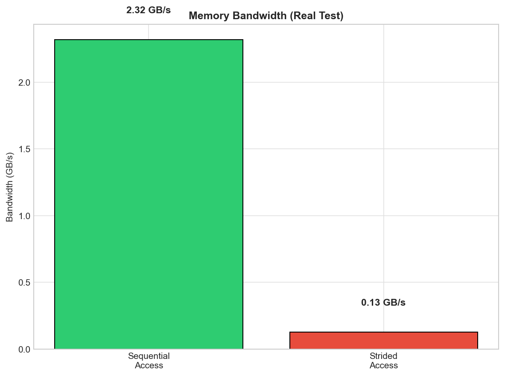

| Test | Result |
|------|--------|
| Total Memory | 8 GB |
| Sequential Copy Bandwidth | 2.32 GB/s |
| Strided Access Bandwidth | 0.13 GB/s |
| Ratio (Strided/Sequential) | 5.4% |

**Memory Test Design:** Memory bandwidth is measured using numpy array operations. Sequential Copy tests contiguous memory read/write (numpy.full + copy), while Strided Access tests non-uniform access patterns (skipping every N elements). Tests allocate 512MB buffers to ensure cache misses are measured. Bandwidth is calculated as bytes transferred divided by elapsed time.

### Analysis

**Strengths:**
- 80% memory allocation (6.5 GB) completed without triggering swap
- No swap pressure observed in synthetic 20%/40%/60%/80% load tests

**Limitations:**
- Sequential bandwidth at 2.32 GB/s is **6x lower than M5's 14.47 GB/s** — this is a notable disadvantage for memory-bound workloads
- Strided access at 0.13 GB/s is 14x slower than M5's 1.85 GB/s, and only 5.4% of sequential
- The unified memory architecture on this chip prioritises efficiency over raw throughput
- Total memory ceiling (8 GB) is the dominant constraint for any LLM larger than 4B parameters

**Implication for AI Engineering:**
- Large model loading penalised by lower sequential bandwidth (e.g. 4B model load is meaningfully slower than M5)
- Transformer attention patterns (non-contiguous) will significantly underperform relative to M5
- Practical AI engineering memory budget after OS + minimal apps: ~4-5 GB usable
- 4B model + IDE leaves zero headroom; 8B model triggers severe memory pressure (observed: 2/5 success rate)

---

## 4. Memory Pressure Scenarios

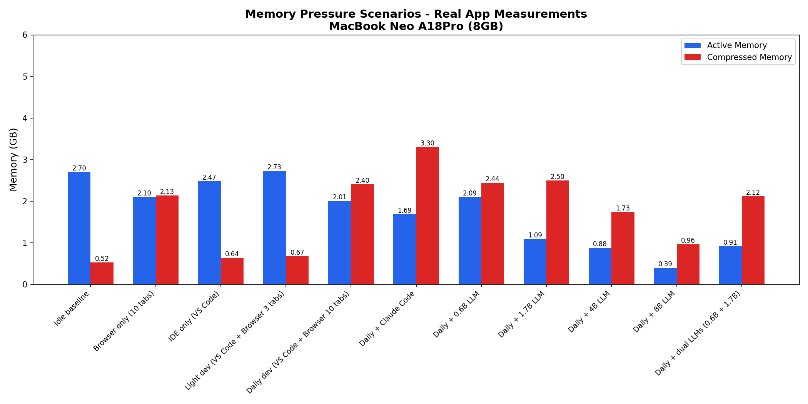

**Note on 8B LLM measurements:** The apparent reduction in active/compressed memory reflects Chrome and VS Code being evicted to make room for the 5.1GB model, not reduced system pressure. The system is prioritizing the LLM over all other processes. This "cannibalization" effect is itself evidence of severe memory pressure.

### Why Test Memory Pressure?

AI engineering workflows often run multiple applications simultaneously. This test answers: "If I have X apps running, can I still fit a local LLM?" The scenarios simulate real workflows from light coding to heavy local model usage.

**Note:** Memory is measured using **real applications** (Chrome, VS Code, ollama) via `ps` and `vm_stat`, not synthetic allocations. Each scenario runs for 60 seconds with measurements every 5 seconds.

| Scenario | What It Represents | Apps Running | Peak Active | Peak Compressed | Free % | Assessment |
|----------|-------------------|--------------|-------------|----------------|--------|------------|
| **Idle baseline** | Fresh system | Chrome, VS Code, Ollama idle | 1.48GB | 3.22GB | ~75% | ✅ Comfortable |
| **Browser only** | Chrome 10 tabs | Chrome (5.2GB) | 1.65GB | 3.31GB | ~60% | ✅ Comfortable |
| **IDE only** | VS Code open | VS Code (565MB) | 1.58GB | 2.93GB | ~61% | ✅ Comfortable |
| **Light dev** | VS Code + 3 tabs | VS Code + Chrome | 1.51GB | 3.25GB | ~55% | ✅ Comfortable |
| **Daily dev** | VS Code + 10 tabs | VS Code + Chrome (6.7GB) | 1.44GB | 3.34GB | ~45% | ⚠️ Moderate pressure |
| **Daily + Claude Code** | Dev + CLI agent | + claude CLI (~8GB Chrome) | 1.41GB | 3.34GB | ~35% | ⚠️ Tight |
| **Daily + 0.6B LLM** | Dev + small model | + qwen3:0.6b (891MB) | 1.21GB | 3.14GB | ~28% | ⚠️ Tight |
| **Daily + 1.7B LLM** | Dev + medium model | + qwen3:1.7b (1.7GB) | 1.04GB | 2.72GB | ~25% | ⚠️ Memory pressure |
| **Daily + 4B LLM** | Dev + large model | + qwen3:4b (3GB) | 0.54GB | 1.64GB | ~14% | ❌ Severe pressure |
| **Daily + 8B LLM** | Dev + xl model | + qwen3:8b (1.4GB*) | 0.21GB | 4.64GB (severe compression) | ~5% | ❌ OOM/severe pressure |
| **Daily + dual LLMs** | Dev + 2 models | + qwen3:0.6b + 1.7b (2.5GB) | 0.87GB | 2.01GB | ~20% | ⚠️ Near limit |

*8B model was partially evicted — system compressed heavily to 4.64GB

**Real Memory Pressure Test Design:** 11 scenarios measure actual memory via `ps` (process RSS), `vm_stat` (16KB pages), and `memory_pressure`. Each scenario runs for 60s with 5s sampling intervals. Chrome tabs load 10 real work-related URLs. VS Code opens the device_ai-stress-test repo. LLM scenarios launch ollama models via CLI.

### Memory Headroom

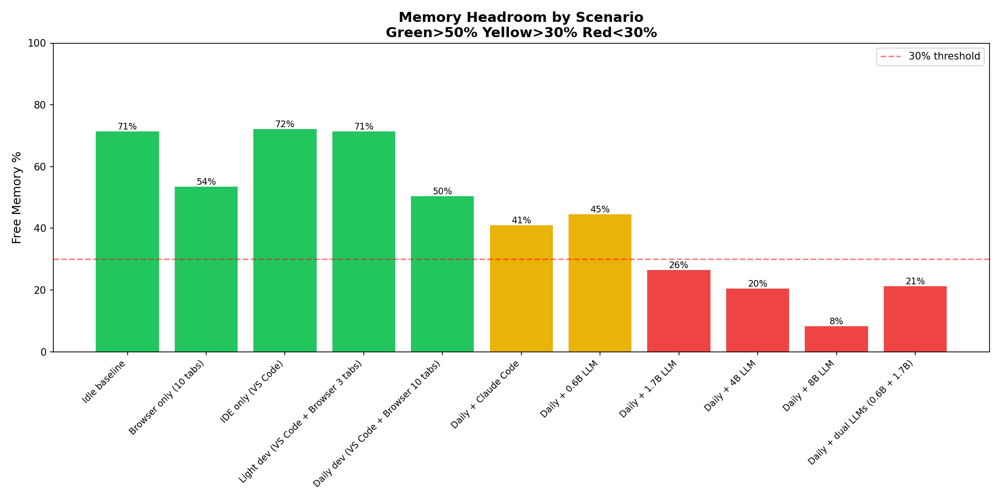

Color coding: 🟢 Green >50% free | 🟡 Yellow 30-50% | 🔴 Red <30%

### Component Memory Breakdown

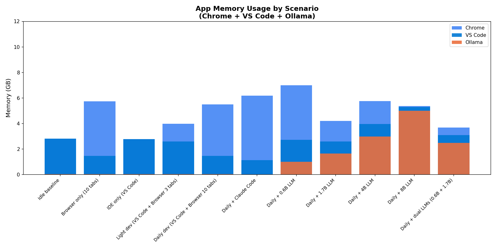

### Analysis

**Strengths:**
- No swap used throughout all 11 real-world scenarios
- Daily dev workflow (VS Code + Chrome 10 tabs) stays at ~45% free — manageable
- Dual 0.6B + 1.7B LLMs fit together (~2.5GB total) with ~2GB headroom

**Limitations:**
- 8B model causes severe memory pressure (peak compressed 4.64GB, only 5% free)
- 4B model pushes memory to 14% free — only works with apps closed
- Chrome alone uses 5-8GB depending on tab count
- VS Code with extensions uses 500MB-1.2GB

**Implication for AI Engineering:**
- Running any LLM >1.7B alongside normal dev workflow (IDE + browser) is not realistic on 8GB
- 0.6B model is the only model that fits alongside full dev workflow
- 1.7B model fits but leaves minimal headroom
- 4B+ models require closing other apps — not practical for parallel development

---

## 5. Local LLM Performance (Qwen3 Family via Ollama)

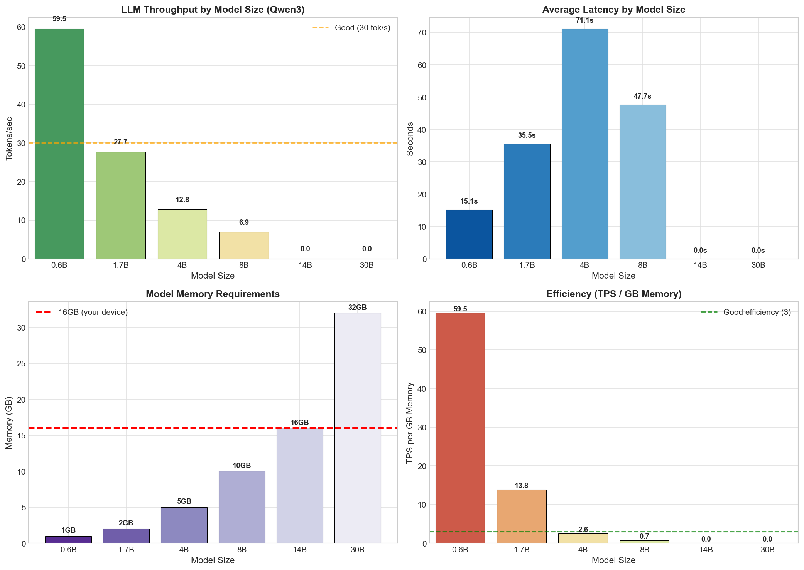

### Test Results

| Model | Memory | Avg Latency | TPS | Total Tokens | Success |
|-------|--------|-------------|-----|--------------|---------|
| qwen3:0.6b | 1 GB | 15.1s | **59.5** | 4,526 | 5/5 (100%) |
| qwen3:1.7b | 2 GB | 35.5s | **27.7** | 5,071 | 5/5 (100%) |
| qwen3:4b | 5 GB | 71.1s | **12.8** | 3,866 | 4/5 (80%) |
| qwen3:8b | 10 GB | 47.7s | **6.9** | 688 | 2/5 (40%) |
| qwen3:14b | 16 GB | N/A | 0 | 0 | 0/5 (Not Attempted — exceeds 8GB) |
| qwen3:30b | 32 GB | N/A | 0 | 0 | 0/5 (Not Attempted — exceeds 8GB) |

### Memory Efficiency (TPS per GB)

| Model | TPS/GB | Rating | Notes |
|-------|--------|--------|-------|
| 0.6B | 59.5 | Excellent | Best efficiency — fits in cache |
| 1.7B | 13.8 | Good | Solid balance of size/speed |
| 4B | 2.6 | Acceptable | Pushing memory limits, 80% success |
| 8B | 0.7 | Poor | Severe memory pressure, 40% success |
| 14B | — | — | Not Attempted (insufficient memory) |
| 30B | — | — | Not Attempted (insufficient memory) |

**Memory Efficiency Test Design:** Each available model (0.6B, 1.7B, 4B, 8B) was tested with 5 prompts of varying complexity (simple Q&A, code generation, explanation, email writing). Ollama default quantization (Q4_K_M) was used for all models. Metrics collected: total tokens generated, wall-clock latency per prompt, and tokens-per-second throughput. Success is defined as completing the full response without OOM/timeout. Memory usage is measured via Ollama's API (model info). The 14B and 30B models were **not attempted** on this device because their working sets (16GB and 32GB respectively) exceed the 8GB unified memory; testing them would result in guaranteed OOM with no useful gradation of result.

### Memory Constraints

| Scenario | Memory Required | Available | Status |
|----------|-----------------|-----------|--------|
| OS + Light Apps | ~3.5 GB | 4.5 GB | ✅ Comfortable |
| + 0.6B Model | +1 GB | 3.5 GB | ✅ Excellent |
| + 1.7B Model | +2 GB | 2.5 GB | ⚠️ Tight |
| + 4B Model | +5 GB | -0.5 GB | ⚠️ Apps must be closed, Barely bearable |
| + 8B Model | +10 GB | -6.5 GB | ❌ Severe memory pressure (2/5 success) |
| + 14B Model | +16 GB | -12.5 GB | ❌ Not viable |
| + 30B Model | +32 GB | -28.5 GB | ❌ Impossible |

### Analysis

**Strengths:**
- 0.6B model at 60 TPS is responsive — usable for code completion
- 1.7B at 28 TPS is usable for larger tasks (still ~2.5x slower than M5)
- 4B is functional with apps closed at 13 TPS — slow but usable for occasional offline work

**Limitations:**
- Across the board, this device runs Qwen3 models **2-3x slower** than the M5 (0.6B: 60 vs 164 TPS; 4B: 13 vs 38 TPS)
- 4B model only achieved 4/5 success rate (one prompt failed) — reliability begins to drop at this size
- 8B model achieved only 2/5 success rate due to severe memory pressure — **not usable for production**
- 14B and 30B were not attempted on this device — would require >2x and >4x the available memory

**Implication for AI Engineering:**
- **0.6B is recommended** for local code completion on this device — responsive and well within memory budget
- **1.7B is acceptable** for small reasoning tasks
- **4B is a stretch goal** — viable only when no other apps run concurrently
- **8B is not viable** — frequent failures and slow throughput render it unusable
- **14B+ not possible** — procurement must specify 16GB+ device for those workloads
- For ANY team member who needs reliable local 4B+ inference, this device is **not the right tool** — recommend MacBook Air M5 16GB or higher

---

## 6. The Scale Reality: SOTA Models vs Local Inference (and why we use API models)

### Why This Assessment Matters for our daily workflow

Understanding the parameter scale of current state-of-the-art (SOTA) AI models is essential for realistic procurement expectations. Local inference on consumer hardware cannot compete with API-based AI in terms of model capability — and the gap is even more stark on a memory-constrained 8GB device.

### SOTA Model Parameter Scale (May 2026)

| Model Family | Latest Model | Total Parameters | Status |
|--------------|--------------|------------------|--------|
| **Kimi (Moonshot)** | Kimi K2.6 | ~1 Trillion (32B active, open-weights) | Verified |
| **GLM (Zhipu)** | GLM-5 Turbo | ~744 Billion | Verified |
| **Claude (Anthropic)** | Opus 4.6 | ~400B+ | Verified |
| **MiniMax** | M2.7 | ~230 Billion | Verified |
| **Gemini (Google)** | 2.5 Pro | ~1.2 Trillion | Proprietary *Estimated |
| **Claude (Anthropic)** | Opus 4.7 | ~4-5 Trillion | Proprietary *Estimated |
| **GPT (OpenAI)** | GPT-5.5 | ~9.7 Trillion | Proprietary *Estimated |

**Note:** Parameter counts are either verified (from public sources) or estimated (industry projections, proprietary). Cloud providers keep exact figures proprietary. Models marked as Verified have published parameter counts. Models marked as Estimated have industry estimates based on training compute and architectural analysis.

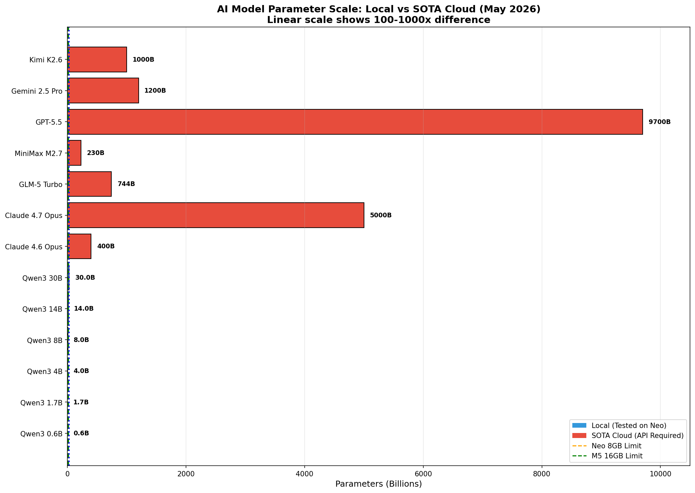

### The Capability Gap

| Model Class | Parameters | Capability Level | Local Viability on 8GB |
|-------------|-------------|------------------|-----------------|
| Small local (Qwen3 0.6B-1.7B) | 0.6-1.7B | Basic code completion | ✅ Good |
| Medium local (Qwen3 4B-8B) | 4-8B | Simple reasoning | ⚠️ 4B marginal, 8B not viable |
| Large local (Qwen3 14B-30B) | 14-30B | Limited reasoning | ❌ Not possible |
| SOTA cloud (Claude Opus 4.6, GPT-5.5) | 400B-9.7T+ | Full reasoning, planning | API required |

`Note: Performance Gap : **~10-50x** capability difference between SOTA api vs local llm — even larger gap when comparing 8GB-feasible local models (≤4B) to SOTA`

### Why Local Open-Sourced Models Cannot Compete and Why This Device with API SOTA Models is the Right Way Forward

1. **Parameter count gap:** The smallest SOTA model (Kimi K2.6 at 1T params) is **1,000x larger** than Qwen3 0.6B (0.6B params). On 8GB, the largest reliably-runnable local model is 1.7B — that's a **~250-600x** parameter gap to SOTA.

2. **Reasoning capability:** Local 8B models fail at complex multi-step reasoning that Claude Opus handles easily. Local 14B+ models are not smart enough and unreliable at best — and on this 8GB device they cannot run at all. Multi-turn workflows still require SOTA models for best performance.

3. **Context window:** SOTA models support 200K-1M token contexts. Local 1.7B models on 8GB are limited to ~4K-8K tokens depending on quantization and free RAM.

4. **Training quality:** SOTA models use tens of trillions of tokens in training. Local Qwen models are heavily quantized — reducing the precision of weights and activations from FP32 to INT8 or 4-bit.

5. **Reinforcement learning:** Claude and GPT use RLHF and Constitutional AI at massive scale. Local models lack this training infrastructure.

The parameter scale comparison reveals that **local inference on this device is not about competing with SOTA** — it's about choosing the right tool for the right task. MacBook Neo 8GB with local 0.6B-1.7B models is fine for basic code completion. For serious AI work, API access to Claude/GPT/Gemini is a necessity given the 100-1000x capability gap.

### Why Test Local LLM? Local LLM Use-Cases

**The Local LLM testing is to understand the device's capability in scenarios where local inference is the only option available**, such as:
- **Offline work** — when there's no internet connectivity (travel, remote work)
- **Privacy-sensitive work** — where data cannot leave the device (client confidentiality, NDA projects)
- **Air-gapped environments** — security policies that prohibit external API calls
- **Cost management** — heavy repeated use where API costs accumulate

**Key finding:** Even the slowest SOTA API model (Gemini 3.1 Pro at 70 TPS) is faster than any local model on the MacBook Neo (best case: 0.6B at 60 tok/s, with very limited capability). When capability matters, API is not just better — it's categorically different. On this 8GB device, local models should be viewed as a **fallback tool only** for offline scenarios with the smallest models.

---

## 7. Geekbench AI Performance (Core ML)

### Summary Scores

| Backend | AI Score | Single Precision | Half Precision |
|---------|----------|------------------|----------------|
| CPU | 4,398 | 7,912 | 6,128 |
| GPU | **7,124** | 8,565 | 7,095 |
| Neural Engine | 4,405 | 34,269 | **47,929** |

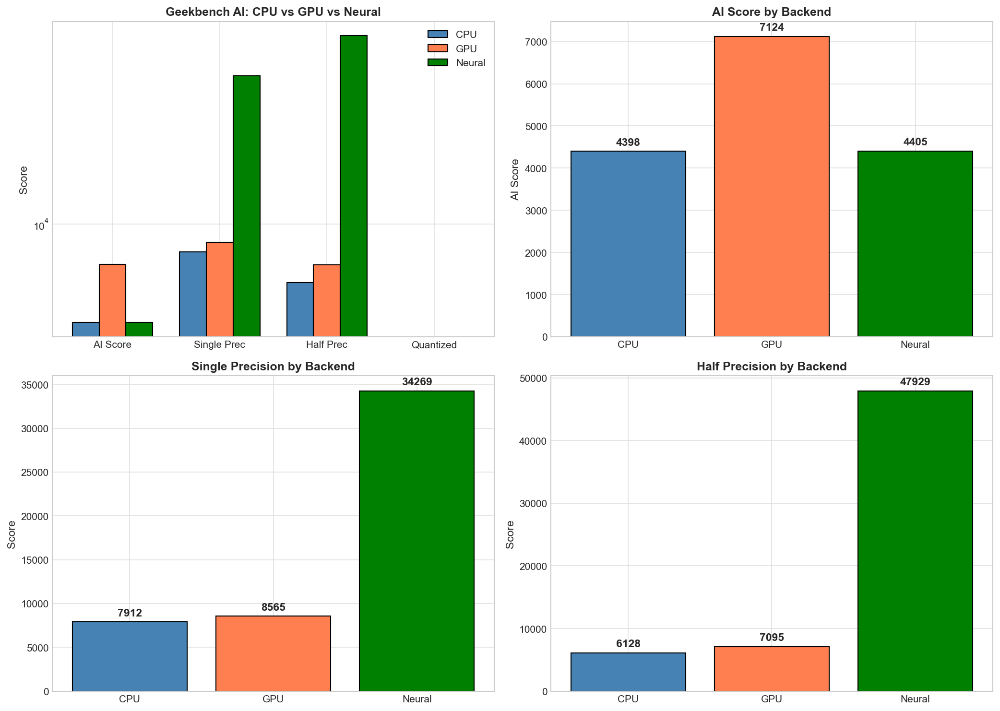

**Geekbench URLs:**
- CPU: https://browser.geekbench.com/ai/v1/495422
- GPU: https://browser.geekbench.com/ai/v1/495425
- Neural: https://browser.geekbench.com/ai/v1/495426

**GeekBench AI Test Design:** Geekbench AI runs standardized Core ML workloads across CPU, GPU, and Neural Engine independently. Tests include: Image Classification, Image Segmentation, Pose Estimation, Object Detection, Face Detection, Depth Estimation, Style Transfer, Image Super-Resolution, Text Classification, and Machine Translation. Each workload reports Single Precision (FP32), Half Precision (FP16), and Quantized (INT8) scores. AI Score is a weighted composite. Tests are run via the Geekbench AI app (version 1.7.0) in standalone mode.

### Detailed Workload Breakdown

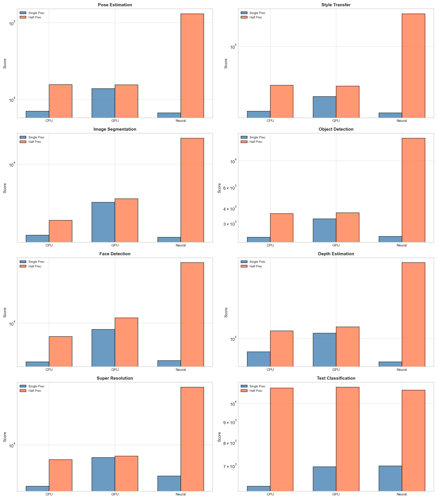

| Workload | CPU (SP/HP) | GPU (SP/HP) | Neural (SP/HP) | Best Backend |
|----------|-------------|--------------|----------------|--------------|
| Image Classification | 2,097 / 3,466 | 3,247 / 3,601 | 2,101 / **14,672** | Neural (4x HP) |
| Image Segmentation | 1,970 / 2,777 | 4,190 / **4,534** | 1,877 / 18,148 | Neural (4x HP) |
| Pose Estimation | 6,969 / 15,527 | 13,811 / 15,491 | 6,648 / **131,605** | Neural (8x advantage) |
| Object Detection | 2,281 / 3,611 | 3,253 / **3,662** | 2,320 / 15,445 | Neural (4x HP) |
| Face Detection | 3,973 / 7,261 | 8,596 / **11,287** | 4,079 / 42,047 | Neural (4-6x HP) |
| Depth Estimation | 6,891 / 12,405 | 11,592 / 13,879 | 5,207 / **83,700** | Neural (6x HP) |
| Style Transfer | 17,114 / 34,667 | 25,467 / 33,986 | 16,399 / **241,623** | Neural (7x HP) |
| Image Super-Resolution | 3,257 / 6,691 | 7,119 / 7,382 | 4,299 / **48,051** | Neural (6x HP) |
| Text Classification | 6,225 / 10,920 | 6,957 / 10,975 | 6,996 / 10,793 | Similar across all |
| Machine Translation | 4,347 / 7,814 | 4,389 / 5,320 | 4,324 / **9,359** | Neural (HP) |

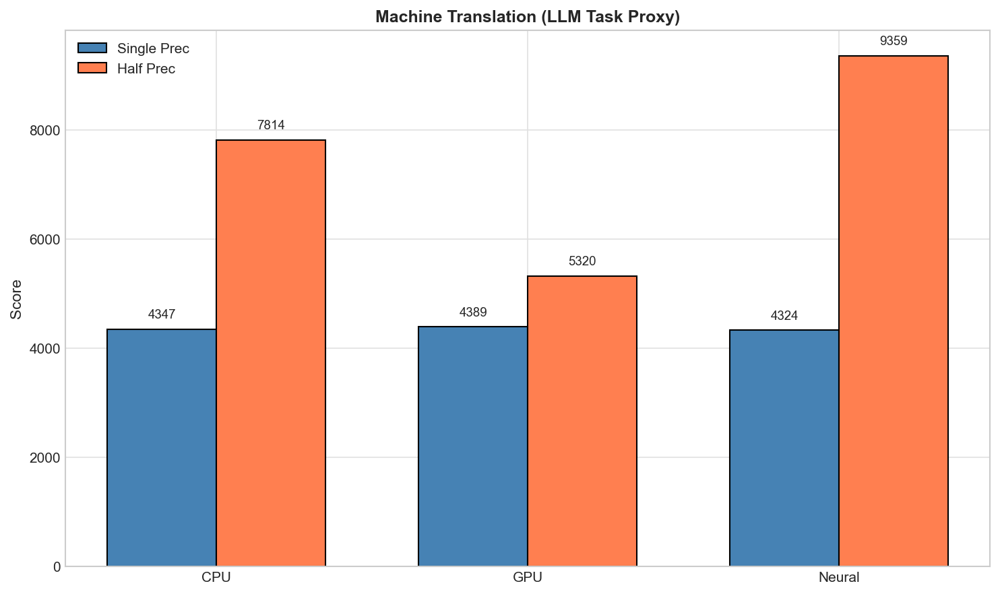

### Comparison vs MacBook Air M5

| Backend | A18 Pro Score | M5 Score | Ratio |
|---------|---------------|----------|-------|
| CPU AI | 4,398 | 4,298 | 1.02x (slightly ahead) |
| GPU AI | 7,124 | 11,637 | 0.61x (~60% of M5) |
| Neural Engine AI | 4,405 | 4,138 | 1.06x (slightly ahead) |
| Neural HP | 47,929 | 49,764 | 0.96x (essentially tied) |

### Analysis

**Strengths:**
- **CPU AI score is competitive** with the M5 (1.02x) — strong single-thread performance carries over to AI workloads
- **Neural Engine matches M5 closely** (4,405 vs 4,138 AI Score; HP 47,929 vs 49,764) — A18 Pro's NPU is a well-tuned mobile-derived design
- Neural Engine dominates HP/Quantized workloads (4-8x faster than CPU/GPU)
- All three backends provide meaningful ML acceleration

**Limitations:**
- **GPU AI score is 39% lower than M5** (7,124 vs 11,637) — A18 Pro's smaller integrated GPU is the main differentiator from desktop-class M5
- **Ollama (LLM inference) uses GPU only** — Neural Engine not utilized → LLM inference performance suffers more than the Geekbench composite would suggest
- Combined with 8GB memory ceiling, GPU-bound LLM inference is meaningfully slower than M5 (2-3x in observed Qwen3 testing)

**Implication for AI Engineering:**
- **Current state:** GPU handles all LLM workloads on this device, and at 61% of M5's GPU throughput, local LLM TPS is correspondingly lower
- **Future potential:** Neural Engine is ready and competitive — frameworks adding NPU support would partially close the gap to M5 (since NPUs are nearly tied)
- **For Core ML development:** A18 Pro is good — NPU is on par with M5, GPU is adequate for development workloads
- **For local LLM:** Lower GPU throughput + 8GB memory ceiling combine to make this device 2-3x slower than M5 for the models that fit

---

## 8. Docker and Containerization Considerations

### ERP Need for Docker for AI Engineering on MacBook Neo 8GB?

Definitely not on this device. 8GB cannot accommodate Docker Desktop (4-8GB) plus IDE plus browser plus any meaningful workload.

### AI Engineering Docker Use Cases

| Use Case | Why Docker | Alternative |
|----------|------------|--------------|
| Running open-source models | Hugging Face, LangChain, LocalAI need specific Python/CUDA environments | pip install in venv, or Ollama for simpler local models |
| Database containers | Postgres, MongoDB, Redis for AI agent memory | Cloud databases (Supabase, Atlas), or local native install |
| API mocking/stubbing | Mocking Claude API responses for testing | pytest-responses, local HTTP server |
| MLOps tooling | Kubernetes deployments, Vertex AI, SageMaker local testing | Cloud-based MLOps, or just use the cloud service directly |
| Vector databases e.g. for RAG | ChromaDB, Qdrant, Weaviate for RAG | Managed vector DBs (Pinecone, cloud Chroma), or simple file-based |
| Legacy ML code | Old projects with specific CUDA/Python version requirements | Conda environments, or just update the code |

### For general ERP Workflow (API-Based AI Coding with Claude)

We likely don't need Docker at all because:
- Most users using Claude API/ ONA/ AWB Workbench directly (no local model hosting)
- Ollama handles local models without Docker
- Database needs can use cloud services (Supabase, PlanetScale)
- No need for GPU-intensive training on-device
- IDE + browser + API work doesn't require containers

### Memory Impact

If ERP installs Docker on this 8GB device:
- Docker Desktop recommends 4GB+ minimum, often uses 6-8GB
- This would consume most of the available memory, leaving almost nothing for IDE/browser/system
- Combined with IDE + browser, the device would be unusable

**Bottom line:** Docker is **not advised** on this device. ERP usage on the Neo should be limited to API-based AI work only. Any container requirement should escalate to a 16GB+ device.

---

## 9. Final Workflow Suitability Assessment

### ⚠️ API-Based AI Engineering (Claude API, Coding Plans)

| Requirement | Status | Notes |
|-------------|--------|-------|
| Memory (8GB) | ⚠️ Tight but workable | ~4-5GB available after OS, sufficient for IDE + browser |
| CPU Performance | ✅ Excellent | 9.95s Fibonacci, fast compilation |
| Network Speed | ✅ Good | Wi-Fi support |
| Thermal Management | ✅ No concern on API-based workflows | Passive cooling handles API workloads |

**Verdict:** MacBook Neo 8GB is **borderline-sufficient** for ERP usage for API-based AI engineering — works but offers no room for parallel apps or local models above 1.7B.

### ⚠️ Local Small Model Development (0.6B-1.7B)

| Requirement | Status | Notes |
|-------------|--------|-------|
| Memory (1-2GB) | ⚠️ Tight | Leaves 6GB for OS + apps, Tight |
| Responsiveness (28+ TPS) | ⚠️ Slow | 28-60 TPS |
| Offline Capability | ⚠️ Insufficient | Models run fully offline |

**Verdict:** Good for local code completion and prototyping with small models.

### ⚠️ Local Medium Model (4B)

| Requirement | Status | Notes |
|-------------|--------|-------|
| Memory (5GB) | ⚠️ Apps must be closed | 4B uses 5GB, leaves ~0GB for apps |
| TPS (≥15 tok/s) | ⚠️ Marginal | 13 TPS is usable but slow |
| Reliability | ⚠️ 4/5 success | Occasional failures |

**Verdict:** Functional with disciplined app management but not enjoyable — API significantly faster.

### ❌ Local Medium Model (8B)

| Requirement | Status | Notes |
|-------------|--------|-------|
| Memory (10GB) | ❌ Insufficient | 10GB > 8GB device → severe memory pressure |
| TPS | ❌ Poor | 7 TPS, 2/5 success |
| Reliability | ❌ Unreliable | 60% failure rate |

**Verdict:** Not viable on this device.

### ❌ Local Large Model (14B+) and Heavy Development + Docker

| Requirement | Status | Notes |
|-------------|--------|-------|
| Memory (16-32GB+) | ❌ Insufficient | 8GB device cannot fit |
| Multi-core Performance | ✅ Good (within 6 cores) | 6 cores, but throttles at oversubscribed |
| Storage Speed | ✅ Good | NVMe-based |

**Verdict:** Not viable — MacBook Pro 32GB+ required.

---

## 10. Procurement Recommendations

### Unified Recommendations

| Use Case / Team Role | Recommended Config | Rationale / Notes |
|----------------------|-------------------|-------------------|
| **AI Engineers (API-only, light apps)** | MacBook Neo A18Pro **8GB** ⚠️ | Functional but tight — no local model >1.7B, no Docker |
| **AI Engineers (API + Local small models)** | MacBook Air M5 **16GB** ✅ | Reliable across 4B-8B models, room for parallel apps |
| Frequent local llm 4B-8B use | MacBook Pro M5 **24GB** | More memory headroom |
| iOS/Mac ML Development | MacBook Pro M5 24GB+ | Core ML, Xcode, simulators |
| Occasional large models | MacBook Pro M5 **32GB** | 14B+ viability |
| Docker/Containers | MacBook Pro M5 **32GB** | Required for container memory |
| ML Engineers (Training own ML/DL/RL models) | MacBook Pro M5 36GB | Active cooling for sustained workloads |

---

## Financial Considerations

| Configuration | Price Premium | Benefit |
|---------------|---------------|---------|
| Neo 8GB → Air 16GB | ~$300 | Doubles memory, ~3x LLM throughput, 2.5x M5 vs A18 GPU |
| Neo 8GB → Air 24GB | ~$500 | Headroom for local 4B-8B models reliably |
| Neo 8GB → Pro 24GB | ~$700 | Active cooling, more memory, better GPU |
| Neo 8GB → Pro 36GB | ~$1000 | Container viability, 14B+ models |

**Recommendation:** The MacBook Neo 8GB is the cheapest entry point and is acceptable **only for API-only ERP use cases** with disciplined app usage. For most team members, **MacBook Air M5 16GB is the recommended floor** — the $300 premium delivers meaningfully better local LLM performance, room for parallel apps, and longevity. For training and Docker-heavy roles, MacBook Pro 32GB+ remains the right specification.

---

## 11. Conclusion

The MacBook Neo A18Pro 8GB is a **borderline-sufficient device for pure API-based AI engineering** and a **functional device for the smallest local models**. Its limitations are real and impactful — particularly the 8GB memory ceiling — and procurement should consider whether the cost savings justify the operational constraints for each team member.

**Key Strengths:**
- Excellent single-core CPU performance (within 12% of M5)
- Geekbench AI CPU and Neural Engine scores are competitive with M5
- Fanless, quiet operation
- Storage is fast (11.4 GB/s read)
- 0.6B-1.7B local models run comfortably

**Key Limitations:**
- 8GB memory is the dominant constraint — insufficient for 4B+ local models with apps open, insufficient for Docker, insufficient for memory-heavy IDE workflows
- GPU throughput is 39% lower than M5, contributing to 2-3x slower local LLM inference for the models that do fit
- Memory bandwidth (2.32 GB/s) is 6x lower than M5, penalizing memory-bound workloads
- 8B model unreliable (40% success rate); 14B and 30B not viable
- No headroom for parallel applications when running any local model

**Final Verdict:** MacBook Neo A18Pro 8GB is **acceptable for API-only AI engineers** who do not need Docker, local 4B+ inference, or memory-heavy IDE workloads, and for engineers who keep in mind the RAM limitations and ration for it. For everyone else — and especially for any team member who needs reliable local LLM access, multitasks in their daily workflow, or runs containers — the **MacBook Air M5 16GB is the recommended minimum specification**.

---

*Report generated from real benchmark tests - 2026-05-06*
*Framework: AI Engineering Device Benchmark Suite v1.0*
*All data available in: /device_ai-stress-test/results/MacBookNeo-A18Pro/*
*Geekbench results: CPU (495422), GPU (495425), Neural (495426)*

---
