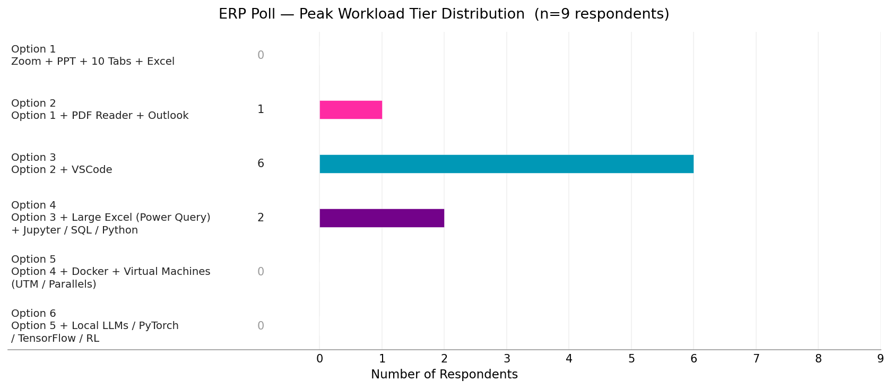
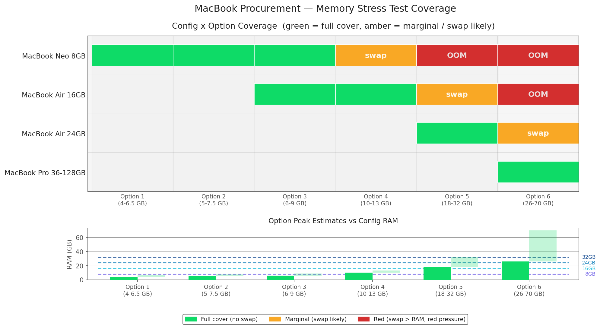

# Hardware Recommendation for ERP Workloads
**Date:** 2026-05-06

---

## Executive Summary

This study evaluates which MacBook configuration can handle each team's peak memory workload without swap. We surveyed six simultaneous application tiers (Options 1–6, from basic office apps to local LLM/PyTorch environments), estimated realistic RAM peaks for each, and mapped them against four hardware configs: MacBook Neo 8GB, MacBook Air 16GB, MacBook Air 24GB, and MacBook Pro 36GB.

**Key findings:** The MacBook Neo 8GB and MacBook Air 16GB covers the majority of ERP workloads (Options 1–4), with exception on users who might need to use PowerQuery to parse from large datasets, concurrently while using other RAM heavy apps. Docker/VM-heavy work requires 24GB. Only local LLM or ML training workloads (Option 6) genuinely need 36GB. Three config tiers are insufficient for their next option tier due to aggressive swap requirements — memory compression alone cannot bridge the gap and would often end up Out-of-Memory(OOM), leading apps to crash.

**Recommendation:** Based on the poll results, most ERP roles will be covered by **MacBook Neo 8GB and MacBook Air 16GB** (Options 1–4). If Docker/VMs are needed, bump to **MacBook Air 24GB**. Only ML workloads (Option 6) justify **MacBook Pro 36-128GB**.

---

We did a poll on 7th May 2026 to better understand ERP members daily workload.

##### Poll:
>Hi Team,
>To ensure our new MacBook configurations handle your workload without lag, I need to understand your simultaneous application usage. Please select the highest tier that represents your typical "peak" workflow (all listed apps running at the same time). This will help us determine which roles require memory upgrades. 
>Thanks

**Your daily peak workflow matches the following (using them simultaneously):**

* [ ] **Option 1:** Zoom + PPT + 10 Tabs + Excel
* [ ] **Option 2:** Option 1 + PDF Reader + Outlook
* [ ] **Option 3:** Option 2 + VSCode
* [ ] **Option 4:** Option 3 + Large Excel (Macros/Power Query) + Jupyter/SQL/Python
* [ ] **Option 5:** Option 4 + Docker + Virtual Machines (UTM/Parallels)
* [ ] **Option 6:** Option 5 + Local LLMs/PyTorch/TensorFlow/RL Environments

##### Poll results:

---

**Estimated Memory Demand**

| Application | Typical RAM | Notes |
|-------------|-------------|-------|
| **macOS Baseline** | ~3 GB | Core system: kernel, WindowServer, daemons. File cache fills remaining RAM — immediately released under pressure. |
| Zoom | ~0.5 GB | Video call (~300 MB); screen share adds ~400 MB |
| PowerPoint | ~0.5 GB | Light–moderate presentations |
| Browser (10 tabs) | ~1-2 GB | Safari ~50–150 MB/tab; Chrome ~200–300 MB/tab |
| Excel (standard) | ~1 GB | Lightweight spreadsheets |
| Excel (large w/ macros) | ~3 GB | Power Query / large datasets; up to 6+ GB under heavy load |
| PDF Reader | ~0.3 GB | Adobe Acrobat or similar |
| Outlook | ~0.5 GB | With email cache loaded |
| VSCode | ~0.6 GB | Plus extensions; large projects more |
| Jupyter/SQL/Python | ~2.5 GB | Data science workloads; ~1–4 GB |
| Docker | ~2.5 GB | Per active container; ~1–4 GB total |
| Virtual Machines (UTM/Parallels) | ~6 GB | Per VM; Windows VMs typically heavier; range ~4–8 GB |
| Local LLMs | ~10 GB | 7B models ~4–6 GB; 13B models ~8–12 GB; 70B models ~35–40 GB (QLoRA/4-bit); range ~4–40 GB |
| PyTorch/TensorFlow | ~9 GB | Inference ~2–4 GB; training ~8–16 GB; range ~2–16 GB |
| RL Environments | ~10 GB | Gym + models + experience buffers; range ~4–16 GB |

---

**Understanding the color coding:**
- **Green** — RAM fully covers the workload peak. No swap, no compression overhead.
- **Amber** — RAM is close to the peak. macOS memory compression (`Apple Memory Compressor`) handles the gap actively. Performance remains acceptable; swap is possible but light.
- **Red** — Peak exceeds RAM by a significant margin. Active disk swap is unavoidable; performance drops 10–100× and red memory pressure will trigger. Running apps will crash or be force-quit.

*Memory compression is always active on Apple Silicon — it helps in amber cases but cannot compensate for large gaps. Swap means the system is paging to SSD/flash, not just compressing in RAM.*

**Total Peak Estimates by Options**

| Option | Est. Peak | Config | Failure Mode if Over RAM |
|--------|-----------|--------|-------------------------|
| Option 1 | ~4–6.5 GB | MacBook Neo 8 GB | Neo 8 GB: memory compression active; yellow pressure under load. Air 16 GB: no issues. |
| Option 2 | ~5-7.5 GB | MacBook Neo 8 GB | Neo 8 GB: memory compression active, near limit. Air 16 GB: comfortable. |
| Option 3 | ~6-9 GB | MacBook Neo 8 GB or MacBook Air 16 GB | Air 16 GB: yellow pressure with all apps open; swap ~1–2 GB possible under heavy VSCode use. Consider 24 GB if many extensions used. |
| Option 4 | ~10–13 GB | MacBook Neo 8 GB or MacBook Air 16 GB | Air 24 GB: adequate. 16 GB: swap 2–4 GB, yellow pressure likely. |
| Option 5 | ~18–32 GB | MacBook Air 24-32 GB | 24-32 GB: adequate for most Docker/VM workloads. 16 GB: swap heavy, red pressure. |
| Option 6 | ~26–70 GB | MacBook Pro 36-128 GB | 36-128 GB: adequate for most ML workloads; Transformer model training requires 128GB and above for large datasets |

*Failure mode chain: yellow memory pressure → active swap (10–100× slower) → red pressure → "Out of application memory" dialog → forced app quit.*

---